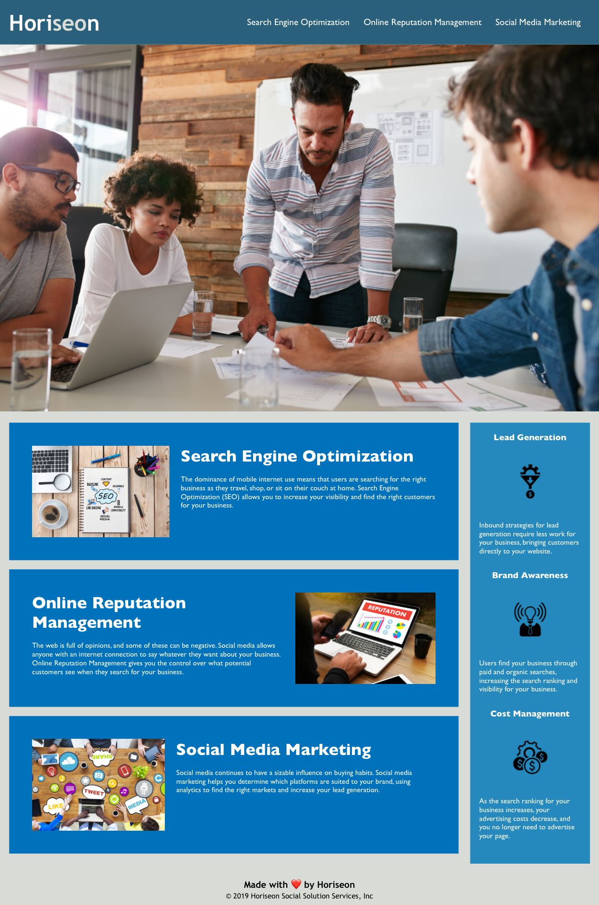

# Horiseon-CSS-Refactor
## Description
I built this project to update the accessibility features of the website, enabling customers to use screen readers, braille keyboards and video captions.
<li>When a user clicks on an image or icon, then they will see alternative text to describe each image and icon</li>
<li>>When a website visitor clicks on a link, then they will be directed to that particular section of the page</li>
### Installation
N/A
### Mock-up

#### Website URL
https://jimbobster.github.io/First-Challenge-Accessibility/
### Credits
N/A
### License
MIT License. Please refer to the license in the repository for more information.
